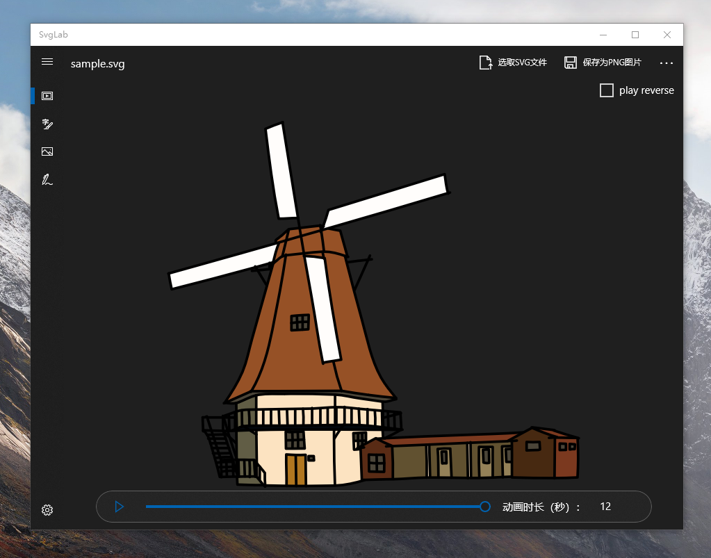

# SvgLab
SvgLab is an application for rendering SVG and drawing hand-drawn animation.

## Download

SvgLab is based on the SvgConverter library.

SvgConverter:download from [Nuget](https://www.nuget.org/packages/SvgConverter/)

SvgLab:download from [Microsoft Store](https://www.microsoft.com/store/apps/9PCN16MMNHPN)

### Screenshot:
 
**GIF:**
 